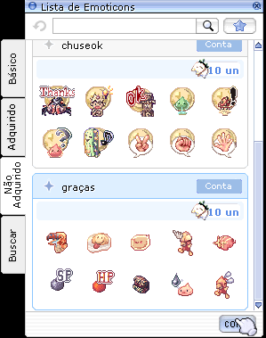

# Yufa Project

## 🐛 "Bugs"

- **Site (Database):** O monstro `1511 Amon Ra` está sem a lista de drops visível.
- **Site (Database):** O monstro `1117 Evil Druid` está sem a imagem do drop `Skull Cap [1]`.
- **Mecânica de Teleport:** Habilidades ou itens de teletransporte não devem teleportar o jogador exatamente em cima de portais (_warps_).
- **Frequência de Skills:** Monstros usam habilidades excessivamente. No estado de ataque (_attack state_), a chance padrão deveria ser de ~5% para poucas habilidades.
- **Linha de Visão (LoS):**
  - Qualquer habilidade deve falhar se o alvo estiver atrás de uma parede ou bloco intransponível em relação ao conjurador (_caster_).
- Skill detect de monstros não deveria ser acionado por qualquer skill, mas apenas as que contém tempo de conjuração (casting)
- Monstros deveriam abandonar o alvo quando estes passam por portais ou teleportam

## 💡 Sugestões

- Incluir monstro `IRON_FIST` como fonte alternativa de Ferro e Aço.
- Adicionar drop `5111 Galapago_Cap` ao monstro `1391 GALAPAGO`

- Quest para mudar paleta de cores dos personagens de acordo com as tintas existentes no jogo
  
  
  
  
  
  
  
  
  

### Conteúdo do Site

- Adicionar lista de drops da **Old Blue Box (OBB)**.
- Adicionar lista de drops da **Old Purple Box (OPB)**.
- Adicionar lista de drops do **Old Card Album (OCA)**.
- Adicionar Feudo de Sograt `gld_dun05` ao Map Database
- Adicionar `1154 Pasana` ao Mob Database
- Adicionar `1098 Anubis` ao Mob Database

### Loja de Cash / Serviços

- Serviço de **Mudar paleta de cores** do personagem (sem carnaval, só as variações oficiais)
- Serviço de **Mudar Conta** do personagem.
- Serviço de **Mudar Slot** do personagem.
- Serviço de **Troca de Sexo**.
- Serviço de **Troca de Nome**.
- Pacotes dos seguintes emojis customizados:
  - 

### 📈 Quality of Life (QoL)

- Mostrar o HP dos monstros. Apesar de existir a skill sentido sobrenatural, ela já tem sua importância perdida por conta de databases.

### ⚙️ Configurações do Servidor

_(Recomendado divulgar no Site ou Discord para os jogadores)_

- **MvP / Mini-Boss:**
  - Sem túmulo de MvP.
  - Respawn de MvP fixo em 1 hora.
  - Respawn de Mini-Boss fixo em 30 minutos.
- **Mecânicas Old Times:**
  - Habilidades dos monstros (_skill set_) baseadas na era Old Times.
  - HP dos MvPs baseado na era Old Times.
- **Drops Customizados:**
  - **Angeling:**
    -  `1.00%` Espírito Olímpico
  - **Shinobi:**
    -  `0.01%` Ramen Hat
  - **Boneco de Miyabi:**
    -  `0.01%` Ninja Scroll
  - **Mascarado:**
    -  `0.01%` Gangster Scarf
  - **Serial Killer:**
    -  `0.01%` Hackey Mask
  - **Poltergeist:**
    -  `0.01%` Angry Snarl
  - **Gato de Folha:**
    -  `0.01%` Leaf Cat Hat
  - **Eddga:**
    -  `1.00%` King Tiger Doll
  - **Snake:**
    -  `0.01%` Chapéu de Jibóia
  - **PecoPeco:**
    -  `0.01%` Peco Ears
  - **Grand Peco:**
    -  `0.01%` PecoPeco Hairband
  - **Elder:**
    -  `1.00%` Black Frame Glasses
  - **Alarm:**
    -  `0.20%` Clip
  - **Pirate Skeleton:**
    -  `0.01%` Adaga Pirata
  - **Druida Maligno:**
    -  `0.01%` Boné Caveira
  - **Tritão:**
    -  `0.01%` Fish in Mouth
  - **Alice:**
    -  `0.01%` Alice Doll[1]
  - **Drakula:**
    -  `0.04%` Necklace
  - **Lady Tanee:**
    -  `Removido` Steamed Desert Scorpions
    -  `Removido` Fantastic Cooking Kit
    -  `5.00%` Shoes
    -  `30.00%` Yggdrasil Seed
  - **Bacsojin:**
    -  `Removido` Red Silk Seal
    -  `5.00%` Muffler
  - **Tao Gunka:**
    -  `1.00%` Robo Eye

## ⚔️ Habilidades (Skills)

#### ⛪ Acolyte

- **Cure:** Corrigir a descrição. A habilidade diz causar status negativos em monstros mortos-vivos (_undead_), mas o efeito não aplica.

##### 🕊️ Priest

##### 👊 Monk

#### 🏹 Archer

##### 🦅 Hunter

- **Traps:** O atraso (_cooldown/delay_) entre o uso de armadilhas está muito longo (atualmente em 1 segundo).

##### 🪕 Bard

##### 💃 Dancer

#### 🔮 Mage

- **Energy Coat:** Ataques físicos que resultam em dano zero (0) não devem consumir SP. Efeitos de _Kyrie Eleison_ e _Devotion_ devem continuar consumindo normalmente.

##### ⚡ Wizard

##### 📖 Sage

#### 🛒 Merchant

##### ⚒️ Blacksmith

##### ⚗️ Alchemist

#### ⚔️ Swordsman

##### 🏇 Knight

##### 🛡️ Crusader

#### 🗡️ Thief

- **Steal:** Melhorar o feedback visual/texto da habilidade quando o monstro já foi roubado.
  - _Opção 1:_ Mudar a mensagem atual ("Habilidade falhou.") para "Não há itens para serem roubados".
  - _Opção 2:_ Exibir o emoticon `/x` na cabeça do monstro ou do jogador em caso de falha por mob já roubado.
##### 👤 Assassin
##### 🎭 Rogue

#### 👶 Novice

##### 👑 Super Novice

#### 🥋 Taekwon Boy / Girl

##### ☀️ Star Gladiator

##### 👻 Soul Linker

#### 🥷 Ninja

##### 🦊 Kagerou

##### 🌸 Oboro

#### 🔫 Gunslinger

##### 🦾 Rebel
